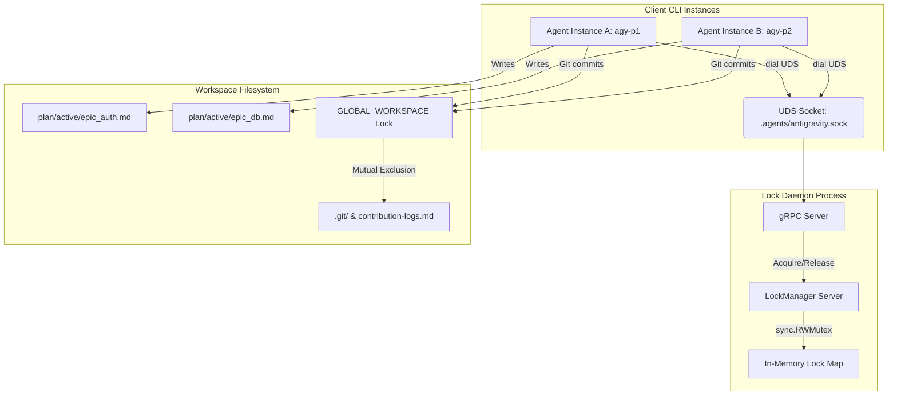
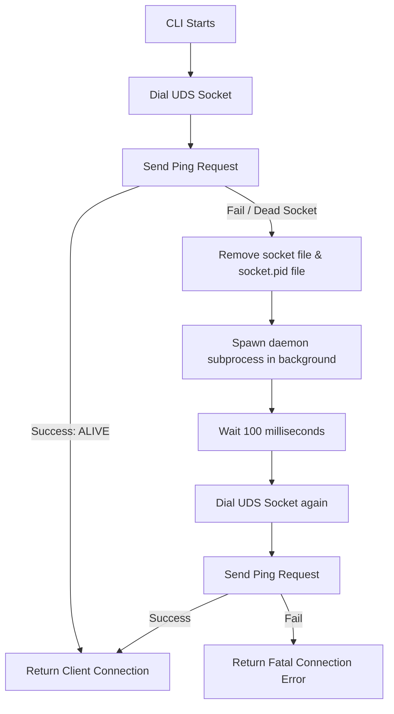

# Architectural Specification: Antigravity UDS Lock Daemon & Parallel Plan Execution

This document details the design, protocols, process lifecycles, and concurrency controls of the `antigravity-daemon` and `antigravity-cli` subsystem.

---

## 1. System Overview & Context

When multiple agent instances execute concurrently in a single workspace, they share critical resources such as plan states, git repositories, and log files. Without atomic coordination, concurrent writes lead to state overwriting, git index lock collisions, and history corruption.

The `antigravity` lock system resolves this using a lightweight, background Unix Domain Socket (UDS) gRPC daemon that manages locks in memory.

### System Architecture Diagram


---

## 2. UDS & gRPC Transport Protocol

Communication between the CLI and the daemon occurs over a Unix Domain Socket (UDS) using gRPC.

### Rationale for UDS
* **Performance:** Zero network stack overhead; operates purely within the kernel loopback.
* **Security:** Access is governed by standard Unix filesystem permissions of the `.agents/` directory, preventing unauthorized local network clients from hijacking locks.
* **Socket Location:** `.agents/antigravity.sock` (relative to the workspace root).

### Protobuf Contract (`proto/sync.proto`)
The service defines three simple RPC methods:

```protobuf
syntax = "proto3";
package sync;
option go_package = "./pb";

service LockManager {
  // Health check to verify the daemon is alive
  rpc Ping (PingRequest) returns (PingResponse);
  
  // Attempt to claim a resource
  rpc AcquireLock (LockRequest) returns (LockResponse);
  
  // Release a claimed resource
  rpc ReleaseLock (LockRequest) returns (LockResponse);
}

message PingRequest {}
message PingResponse {
  string status = 1; // "ALIVE"
}

message LockRequest {
  string resource_id = 1; // Target resource name (e.g., plan path or "GLOBAL_WORKSPACE")
  string agent_id = 2;    // Requester identifier (e.g., "pid-12345")
}

message LockResponse {
  bool granted = 1;       // True if claim succeeded
  string message = 2;     // "LOCKED", "RELEASED", or "LOCKED_BY_agent-xxx"
}
```

---

## 3. In-Memory Lock Manager Server

The daemon maintains state entirely in-memory using standard Go synchronization primitives. No external database or disk operations are used.

### Data Structures
```go
type LockState struct {
    AgentID   string
    ExpiresAt time.Time // Lease deadline (time-to-live)
}

type LockServer struct {
    pb.UnimplementedLockManagerServer
    mu    sync.RWMutex
    locks map[string]LockState // Maps resource_id -> LockState
}
```

### Core Logic Flows

#### 1. AcquireLock Flow
```mermaid
flowchart TD
    Start[Receive AcquireLock Request] --> Lock[Lock s.mu RWMutex]
    Lock --> CheckExist{Resource Exist in Map?}
    
    CheckExist -- No --> Grant[Create LockState with 5-minute TTL]
    Grant --> Unlock[Unlock RWMutex] --> ReturnTrue[Return Granted: true]
    
    CheckExist -- Yes --> CheckExpired{Is time.Now() > ExpiresAt?}
    CheckExpired -- Yes --> Evict[Evict Stale Lock & Grant to New Requester]
    Evict --> Unlock --> ReturnTrue
    
    CheckExpired -- No --> Deny[Deny Request]
    Deny --> Unlock --> ReturnFalse[Return Granted: false, Message: LOCKED_BY_Holder]
```

#### 2. ReleaseLock Flow
* **No Exist:** If the resource key is not in the map, the server returns `Granted: true` (since the resource is free).
* **Exist & Stale:** If the lock is expired, the server deletes the key and returns `Granted: true`.
* **Exist & Matching Agent ID:** If `req.AgentId` matches the lock's `AgentID`, the server deletes the key and returns `Granted: true`.
* **Exist & Wrong Agent ID:** If the lock is active and owned by another agent, the server returns `Granted: false` and `Message: "LOCKED_BY_owner"`.

---

## 4. Daemon Bootstrapping & Process Lifecycle

CLI instances must execute seamlessly without requiring the user to manually start or manage a daemon process. This is handled by a self-healing background spawner.

### Bootstrapping Algorithm


### Process Detachment (Unix/Linux)
To ensure the spawned daemon survives the termination of the parent CLI process (e.g., when the terminal shell closes), it is launched with detached session credentials:

```go
cmd := exec.Command(execPath, "daemon")
cmd.Dir = workspaceRoot
cmd.SysProcAttr = &syscall.SysProcAttr{
    Setsid: true, // Creates a new session group (daemon detached from parent tty)
}
// Close standard streams to prevent blocking
cmd.Stdin = nil
cmd.Stdout = nil
cmd.Stderr = nil
cmd.Start()
```

### PID Tracking & Clean Teardown
On startup, the daemon writes its Process ID (PID) to `.agents/antigravity.sock.pid`. 
* When the daemon receives a graceful shutdown signal (`SIGINT` or `SIGTERM`), it triggers gRPC's `GracefulStop()`, deletes the UDS socket file, and deletes the `.pid` file.
* This allows automated testing tools or management scripts to cleanly read the PID file and terminate the process if needed.

---

## 5. Parallel Plan Directory States

To prevent concurrent agents from bottlenecking on a single plan file, state queuing shifts from `active_plan.md` to directory-based routing.

### Directory Mapping
* **Legacy file path:** `.agents/plan/active_plan.md`
* **Modern queue path:** `.agents/plan/active/{target_file}.md`

### Path Resolver (`GetActivePlanPath`)
The workspace resolver implements path resolution for plan files:
```go
func GetActivePlanPath(planName string) (string, error) {
    root, err := FindWorkspaceRoot()
    if err != nil {
        return "", err
    }
    if planName == "" {
        // Fallback for default execution mode
        return filepath.Join(root, ".agents", "plan", "active_plan.md"), nil
    }
    return filepath.Join(root, ".agents", "plan", "active", planName), nil
}
```

### Instance Binding (`--plan` Flag)
When executing an agent, the `--plan` flag explicitly binds the process to a context:
1. The flag is extracted from `os.Args` on startup (e.g., `--plan=epic_auth.md`).
2. The CLI performs a physical `os.Stat` existence check on `.agents/plan/active/epic_auth.md`.
3. If missing, it immediately throws a fatal error and exits. This protects against hallucinatory execution where an agent creates files from scratch due to typos.

---

## 6. The Global Git Mutex (`GLOBAL_WORKSPACE`)

Although parallel agents write to separate plan files, they share a single `.git` repository and contribution log. If two agents attempt to execute `git commit` simultaneously, git index lock conflicts (`.git/index.lock`) will corrupt the repository.

To solve this, we introduce the **Global Git Mutex**.

### Lock Escalation Rule
Any call to the file-writing API (`WriteFileWithLock`) checks the target path. If the path contains `contribution-logs.md`, the lock resource ID is automatically escalated from the file path to the reserved resource string: `GLOBAL_WORKSPACE`.

```go
lockResource := relPath
if strings.Contains(relPath, "contribution-logs.md") {
    lockResource = "GLOBAL_WORKSPACE"
}
```

### Git Command Locking Wrapper (`RunGitCommandWithLock`)
All workspace-wide git mutations are wrapped in a locking function:
1. Connects to the daemon.
2. Acquires the `GLOBAL_WORKSPACE` lock (retrying up to 15 times with 200ms sleep).
3. Executes the git command (`git commit`, `git add`, etc.) on the filesystem.
4. **Deferred Release:** Utilizes Go's `defer` block to guarantee the release of the `GLOBAL_WORKSPACE` lock regardless of command outcome or process panics.

---

## 7. Testing & Validation Architecture

Testing UDS self-spawning subprocesses is notoriously complex because Go test binaries run under temporary directories and compile to temporary paths.

### Subprocess Testing Hook
To test the spawner without compiling the binary first, we inject an initialization hook in the test suite:

```go
func init() {
    // Intercept when the test binary spawns itself with the "daemon" argument
    if len(os.Args) > 1 && os.Args[1] == "daemon" {
        workspaceRoot, _ := client.FindWorkspaceRoot()
        socketPath := filepath.Join(workspaceRoot, ".agents", "antigravity.sock")
        daemon.Run(socketPath)
        os.Exit(0)
    }
}
```
When `ConnectAndBootstrap` calls `os.Executable()`, it spawns the temporary test binary. The spawned subprocess enters `init()`, runs the gRPC server, and blocks. The parent test process pings it, executes the test cases, and then terminates the spawned process.

This ensures 100% test coverage of the production bootstrap and spawning lifecycle.
